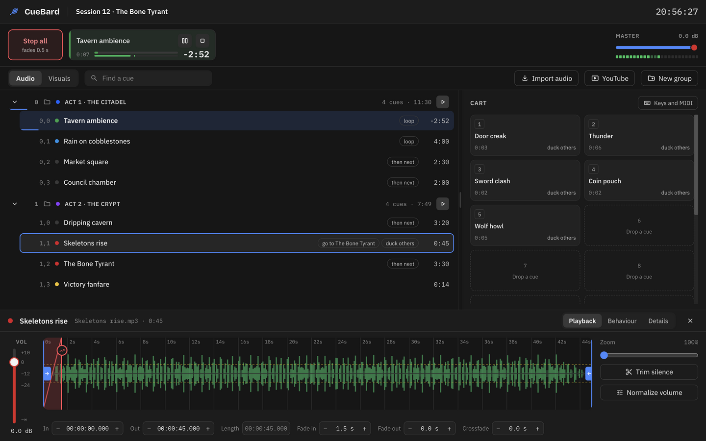
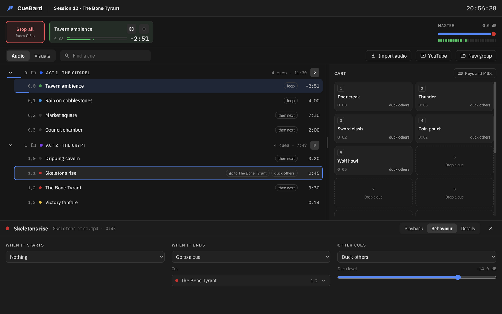
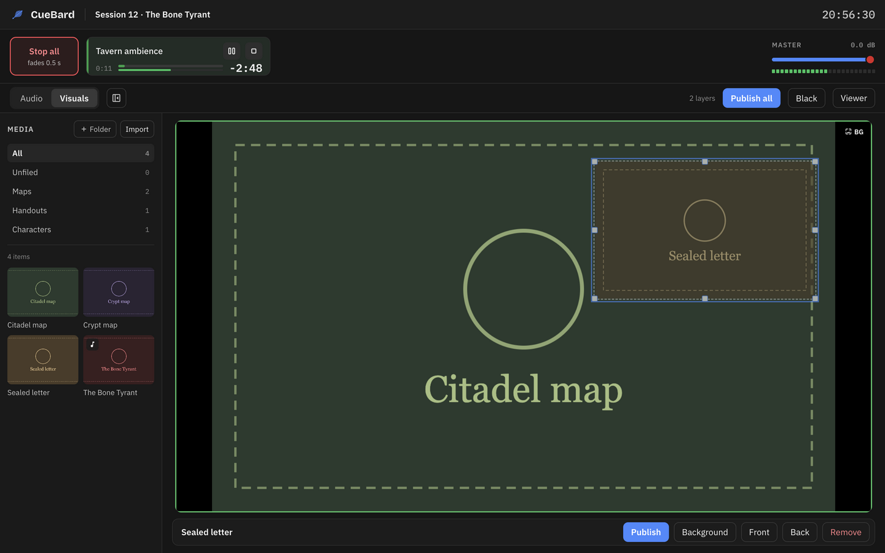
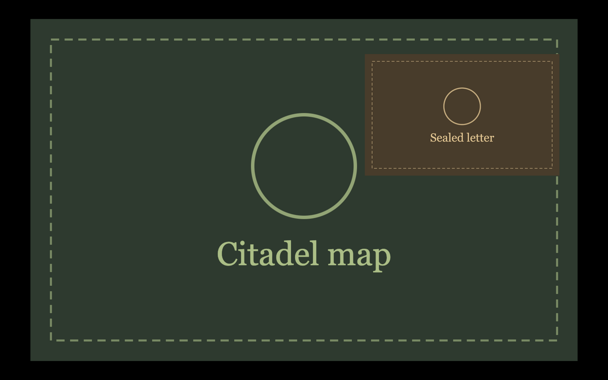
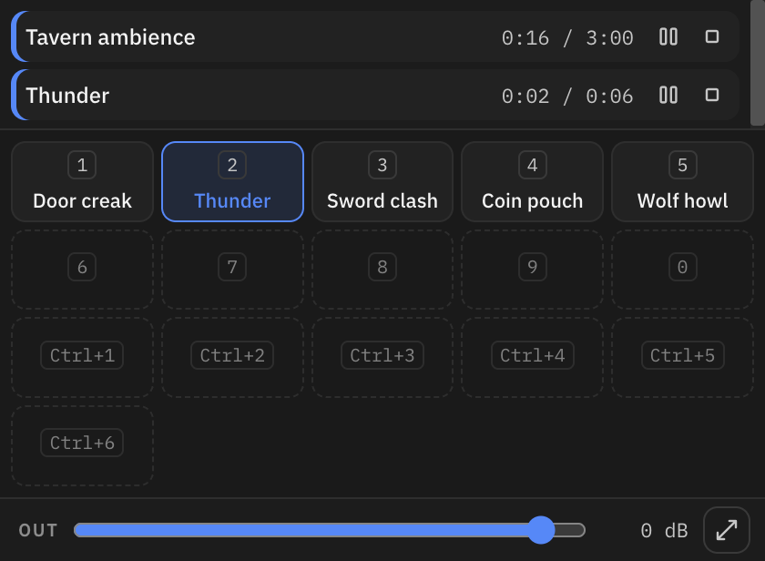
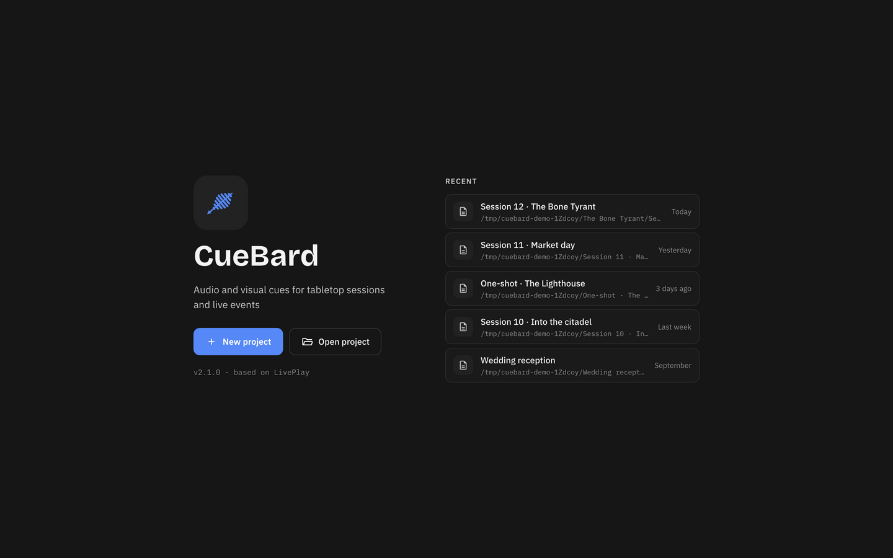

# CueBard

CueBard plays audio and visual cues for tabletop role-playing sessions and
small live events: background music, ambience and sound effects on one side,
pictures and handouts on a second screen or a tablet on the other.

CueBard is based on [LivePlay](https://github.com/tdoukinitsas/liveplay) by
Thomas Doukinitsas and was called E-LivePlay until version 1.9. It is a
separate project now: upstream LivePlay moved to a C++ audio server, CueBard
stays an Electron app with its own visual display.

## Download

Get the latest version from
[Releases](https://github.com/Stevesibilia/cuebard/releases/latest).

| System                | File                                           |
| --------------------- | ---------------------------------------------- |
| Windows               | `CueBard-Setup-<version>.exe`                  |
| macOS (Apple Silicon) | `CueBard-<version>-arm64.dmg`                  |
| macOS (Intel)         | `CueBard-<version>.dmg`                        |
| Linux                 | `CueBard-<version>.AppImage`, `.deb` or `.rpm` |

The macOS builds are not signed. On first launch, right-click the app and
choose **Open**. CueBard checks for updates at start; on Windows and Linux it
installs them for you, on macOS it opens the download page.

### Coming from E-LivePlay

- **Windows**: the update replaces E-LivePlay.
- **macOS and Linux**: CueBard installs next to E-LivePlay. Remove E-LivePlay
  when CueBard works for you.
- On first start CueBard copies your language, MIDI mapping and the downloaded
  yt-dlp from E-LivePlay. E-LivePlay's own settings are left as they are.
- Your projects open as before. A `.liveplay` project is saved back to the same
  file; new projects are saved as `.cuebard`.

## Features

### Audio



- A playlist of cues in groups, with colours, trim points and waveforms.
- The strip at the top shows every playing cue, with its time left, pause and
  stop. **Stop all** fades everything out in half a second; Esc stops at
  once.
- **Find a cue** filters the playlist by name.
- A cart with 16 slots for one-shots, such as a door creak or a thunderclap.
- Cues import from files, or from a YouTube search (yt-dlp and ffmpeg are
  bundled).

Select a cue to open its properties. **Playback** holds the waveform, volume,
trim points and fades, plus Trim silence and Normalize volume. **Behaviour**
says what happens when the cue starts and ends (play the next cue, go to
another cue, loop) and what it does to the other cues (stop them, duck them,
or leave them alone). **Details** holds the name, the colour, the file and the
trigger URL for the API.



### Visuals



- A media library for images and PDFs, sorted into folders. Only images can
  go on the canvas for now.
- Drag a picture onto the canvas to make a layer. Layers stay drafts until you
  publish them, so you can arrange them before the players see anything.
- A layer can be the background, fade in and out, and be linked to a cue that
  plays when it is published.
- **Black** clears the screen; the background stays.
- The player window shows the published layers on a second monitor.

### Tablets and phones



Tablets and phones on the same Wi-Fi can show the published layers in a
browser, with no app to install. See [Remote viewer](#remote-viewer) below.

### Control

- Keyboard hotkeys and MIDI for the cart slots, pause and resume, loop, stop
  all and master volume (the **Keys and MIDI** button on the cart).
- An HTTP API to trigger and stop cues from other software or devices. See
  [Remote control API](#remote-control-api) below.
- Minimal mode (View menu, Ctrl+M or Cmd+M): a small window with the playing
  cues, the cart and the master volume.



### Everything else

- Four themes (Cobalt, Calm Slate, Classic Dark, Classic Light) and a custom
  accent colour, in the View menu.
- The welcome screen lists the projects you opened last.
- 21 interface languages; missing translations fall back to English.
- A project is one file plus `media/` and `waveforms/` folders. An archive
  packs a whole project into one file.



## Files

| Extension   | What                 | Notes                    |
| ----------- | -------------------- | ------------------------ |
| `.cuebard`  | Project              | New projects             |
| `.cbpack`   | Project archive      | Export and import        |
| `.liveplay` | Project (E-LivePlay) | Opens and saves in place |
| `.lpa`      | Archive (E-LivePlay) | Imports                  |

Files saved by upstream LivePlay 2.5 or later are not compatible.

## Remote control API

> **Same machine only by default.** The API answers requests from the computer
> CueBard runs on (`localhost`). To trigger cues from another device, open
> **Viewer** in the Visuals toolbar and turn on **Allow remote control from
> network**. The setting is off at every start. Requests a browser sends on
> behalf of another website are always refused.

```bash
# Trigger a cue by UUID (copy the URL from the Details tab of the cue)
curl http://localhost:8080/api/trigger/uuid/<uuid>

# Trigger by the position the playlist shows: the first item, or the first
# item inside the second one (a group)
curl http://localhost:8080/api/trigger/index/0
curl http://localhost:8080/api/trigger/index/1,0

# Stop a cue
curl http://localhost:8080/api/stop/uuid/<uuid>

# Project name and number of top-level items
curl http://localhost:8080/api/project/info
```

## Remote viewer

1. On the Visuals tab, click **Viewer** in the toolbar and turn on **Remote viewer**
   (off by default).
2. A URL such as `http://192.168.1.42:8080/player` and a QR code appear.
3. On a tablet on the same Wi-Fi, scan the QR code or type the URL.

The player window and the remote viewer are independent; use either or both.

> **Local network only.** While it is on, anyone on the same network can see
> the project's visual media, without a password. The viewer only serves files
> from the project's `media/` folder. Turn it off when you are done.

## Development

```bash
npm ci
just dev          # Nuxt + Electron
just test         # vitest
just typecheck    # nuxt prepare + vue-tsc
just build-electron
```

Work goes into `dev` through pull requests, which run the tests and the
typecheck. Releases publish from `main` only: the version in `package.json` is
bumped on `dev`, then a pull request from `dev` into `main` builds and publishes
the release. See [AGENTS.md](AGENTS.md) for the branch and release workflow.

`node scripts/take-screenshots.mjs` takes the screenshots in this README from a
demo project. It starts the dev app, so stop any running dev app or CueBard
first.

## Licence and credits

CueBard is a modified version of LivePlay and, like LivePlay, is licensed under
the **GNU Affero General Public License v3.0**. See [LICENCE.txt](LICENCE.txt).

- LivePlay: Thomas Doukinitsas,
  [github.com/tdoukinitsas/liveplay](https://github.com/tdoukinitsas/liveplay)
- CueBard: Stefano Sibilia,
  [github.com/Stevesibilia/cuebard](https://github.com/Stevesibilia/cuebard)

Built with [Electron](https://www.electronjs.org/), [Nuxt](https://nuxt.com/),
[Vue](https://vuejs.org/), [Howler.js](https://howlerjs.com/),
[yt-dlp](https://github.com/yt-dlp/yt-dlp) and [FFmpeg](https://ffmpeg.org/).
